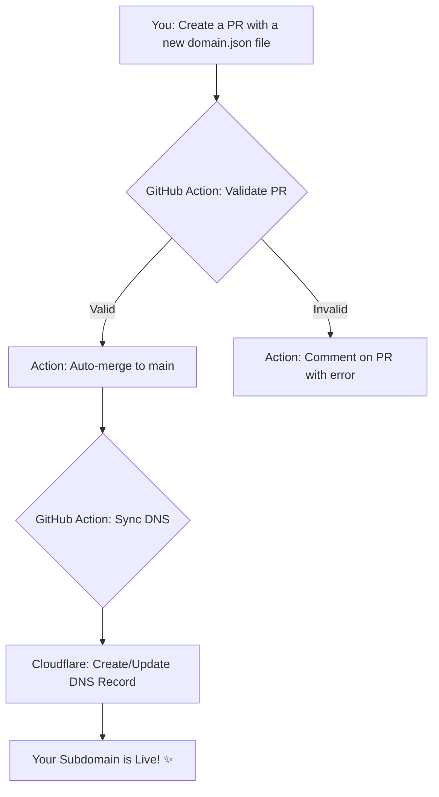

<div align="center">
  <h1>is-a.software</h1>
  <p><b>Free subdomains for developers.</b></p>
  <p>
    <a href="#"></a>
    <a href="#"></a>
    <a href="https://discord.com/invite/AeAjegXn6D"></a>
  </p>
</div>

---

## 🚀 How to Register Your Subdomain

Follow these simple steps to get your free subdomain.

### 1. 🍴  Fork the Repository
First, [fork this repository](https://github.com/is-a-software/is-a-software/fork) to your own GitHub account.

### 2. 📝 Create Your Record File
Navigate to the `domains/` folder and create a new JSON file. The name of this file will be your subdomain.

> **For example:** To register `example.is-a-software`, you must create a file named `example.json`.

### 3. ⚙️ Add Your DNS Records
Open your new JSON file and add the required information. You must include an `owner` section and a `record` section.

* **`owner`**: Your GitHub username.
* **`record`**: The DNS records you want. We support `A`, `AAAA`, and `CNAME`.
* **`proxy`** (Optional): Set to `true` to enable Cloudflare's proxy (orange cloud) or `false` to disable it (DNS only). Defaults to `false`.

#### **JSON File Examples**

**Using a CNAME record (for services like GitHub Pages, Vercel, etc.):**
```json
{
  "owner": {
    "github": "your-username"
  },
  "record": {
    "CNAME": "your-username.github.io"
  },
  "proxy": false
}
```

### 4. 🚀 Create a Pull Request
Once you've created and saved your file, create a Pull Request from your fork back to this main repository.  all checks pass,then it will be automatically merged.

Your subdomain should be live within a few minutes!

> [!NOTE]
> **Make sure to add a good commit message and a good PR title**<br>
> example: `Register: example.is-a.software`<br>

---

## ✨ Features

-   ✅ **Fully Automated:** Just create a Pull Request, and our GitHub Actions handle the rest.
-   ✅ **Fast & Reliable:** Your subdomain is powered by Cloudflare's robust DNS infrastructure.
-   ✅ **Developer-Friendly:** Supports `A`, `AAAA`, and `CNAME` records to point to any service.
-   ✅ **Community Driven:** An open-source project that you can contribute to and help improve.

---

## ⚙️ How It Works: The Automated Workflow

The magic behind `is-a.software` is its fully automated, Git-based workflow. Here’s a visual representation of the process:



---

## 🤝 Contributing

This is a community project, and we welcome contributions! Whether it's improving the scripts, updating the documentation, or fixing a bug, your help is appreciated.

1.  **Fork the repository** and create a new branch.
2.  Make your changes.
3.  Open a **Pull Request** with a clear description of what you've done.

## 💬 Need Help?

Join our official Discord server for support, questions, or just to chat with the community.

<a href="https://discord.com/invite/AeAjegXn6D">
  
</a>

---

<div align="center">
  <p>Licensed under the <a href="LICENSE">MIT License</a>.</p>
  <p>Don't forget to ⭐ the repository if you find it useful!</p>
</div>
