<div align="center">
  <h1>is-a.software</h1>
  <p><b>Free, automated, and professional subdomains for developers.</b></p>
  <p>
    <a href="https://github.com/is-a-software/is-a-software/stargazers"></a>
    <a href="https://github.com/is-a-software/is-a-software/pulls"></a>
    <a href="https://github.com/is-a-software/is-a-software/actions/workflows/validate-pr.yml"></a>
    <a href="https://discord.com/invite/AeAjegXn6D"></a>
  </p>
</div>

---

## ✨ Features

-   ✅ **Absolutely Free:** No hidden costs. Get a professional subdomain at no charge.
-   ✅ **Fully Automated:** Just create a Pull Request, and our GitHub Actions handle the rest.
-   ✅ **Fast & Reliable:** Your subdomain is powered by Cloudflare's robust DNS infrastructure.
-   ✅ **Developer-Friendly:** Supports `A`, `AAAA`, and `CNAME` records to point to any service.
-   ✅ **Community Driven:** An open-source project that you can contribute to and help improve.

---

## ⚙️ How It Works: The Automated Workflow

The magic behind `is-a.software` is its fully automated, Git-based workflow. Here’s a visual representation of the process:

```mermaid
graph TD
    A[You: Create a PR with a new domain.json file] --> B{GitHub Action: Validate PR};
    B -->|Valid| C[Action: Auto-merge to main];
    B -->|Invalid| D[Action: Comment on PR with error];
    C --> E{GitHub Action: Sync DNS};
    E --> F[Cloudflare: Create/Update DNS Record];
    F --> G[Your Subdomain is Live! ✨];
```



---

## 🚀 How to Register Your Subdomain

Follow these simple steps to get your free subdomain.

### 1️⃣ Fork & Create
-   [**Fork this repository**](https://github.com/is-a-software/is-a-software/fork) to your own GitHub account.
-   Navigate to the `domains/` folder and create a new file named `your-subdomain.json`.

### 2️⃣ Configure Your Record
-   Open the new JSON file and add your record details. See the examples below.

<details>
<summary>📄 Click to see JSON configuration examples</summary>

**CNAME Record (for GitHub Pages, Vercel, etc.):**
```json
{
  "owner": {
    "github": "your-username"
  },
  "record": {
    "CNAME": "your-username.github.io"
  },
  "proxy": false
}
```

**A/AAAA Records (for a custom server):**
```json
{
  "owner": {
    "github": "your-username"
  },
  "record": {
    "A": "192.0.2.1",
    "AAAA": "2001:db8::1"
  },
  "proxy": true
}
```
</details>

### 3️⃣ Submit Your Pull Request
-   Create a Pull Request from your fork to the `is-a-software/is-a-software` main repository.
-   Use a clear title like `Register: your-subdomain.is-a.software`.
-   Our bots will check your submission. If it passes, it will be merged automatically.

---

## 📜 Rules & Limitations

-   🚫 **One subdomain per GitHub account.**
-   🚫 **No `NS` or `MX` records.**
-   🚫 **The `owner.github` field must match the GitHub username of the person creating the PR.**
-   🚫 **No reserved names** (e.g., `api`, `blog`, `shop`). Check the [full list](config/reserved.json).
-   Violations of these rules will cause the validation to fail.

---

## 🤝 Contributing

This is a community project, and we welcome contributions! Whether it's improving the scripts, updating the documentation, or fixing a bug, your help is appreciated.

1.  **Fork the repository** and create a new branch.
2.  Make your changes.
3.  Open a **Pull Request** with a clear description of what you've done.

## 💬 Need Help?

Join our official Discord server for support, questions, or just to chat with the community.

<a href="https://discord.com/invite/AeAjegXn6D">
  
</a>

---

<div align="center">
  <p>Licensed under the <a href="LICENSE">MIT License</a>.</p>
  <p>Don't forget to ⭐ the repository if you find it useful!</p>
</div>
